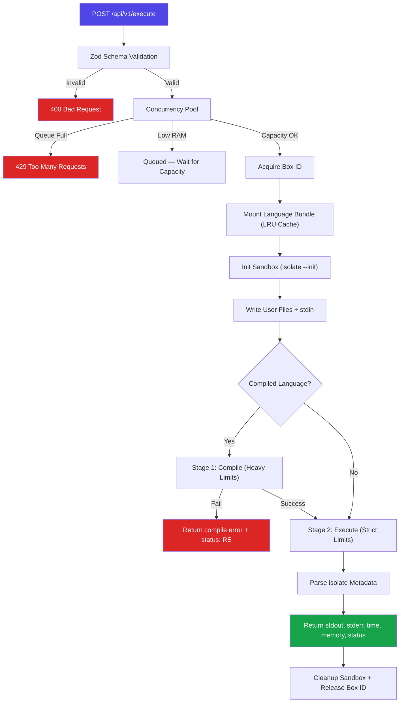

<div align="center">

#  Chadbox

<!-- # 📦 Chadbox -->

### Lightweight, Secure, Open-source,and Self-hostable Code execution engine for untrusted code.

<!-- A lightweight, secure, and self-hostable sandbox for running untrusted code. -->

Built with `isolate`, powered by Linux cgroups v2, and designed to take a beating.

[](https://github.com/cryptomafiaPB/chadbox)
[](LICENSE)
[](https://www.typescriptlang.org/)
[](#-contributing)

[Quickstart](#-quickstart) · [API Reference](#-api-reference) · [CLI Reference](#-cli-reference) · [Contributing](#-contributing)

</div>

Suggest logo for chadbox @[Telegram](https://t.me/chadbox).

---

## Table of Contents

- [What is Chadbox?](#-what-is-chadbox)
- [Why Chadbox?](#-why-chadbox)
- [How It Works](#-how-it-works)
- [Supported Languages](#-supported-languages)
- [Quickstart](#-quickstart)
- [API Reference](#-api-reference)
- [CLI Reference](#-cli-reference)
- [Configuration](#%EF%B8%8F-configuration)
- [Security Model](#-security-model)
- [Roadmap](#-roadmap)
- [Contributing](#-contributing)
- [Community & Support](#-community--support)
- [Acknowledgments](#-acknowledgments)
- [License](#-license)

---

## 🧠 What is Chadbox?

Chadbox is an open-source code execution engine that runs untrusted code in kernel-level sandboxes. You send it code via a REST API, it runs it inside an isolated environment with strict resource limits, and hands you back `stdout`, `stderr`, execution time, and memory usage.

It's what you build when you need a backend for:

- **Online coding platforms** (judges, playgrounds, tutorials)
- **LLM tool-use** (give your AI the ability to run code safely)
- **Interview & assessment systems** (timed, sandboxed code evaluation)
- **CI pipelines** (run student or plugin code without trusting it)

Three commands to go from zero to executing code:

```bash
git clone https://github.com/cryptomafiaPB/chadbox.git
cd chadbox
docker compose up -d --build
```

That's it. You're live on `http://localhost:3000`.

---

## 💪 Why Chadbox?

There are other code execution engines. Here's why Chadbox exists:

|                      | **Chadbox**                                            | **Piston**          | **Judge0**                          |
| -------------------- | ------------------------------------------------------ | ------------------- | ----------------------------------- |
| **Isolation**        | `isolate` (IOI battle-tested, kernel-level cgroups v2) | `isolate`           | `isolate`                           |
| **Language Bundles** | SquashFS — read-only, immutable, loop-mounted          | Copied to disk      | Docker images                       |
| **Mount Strategy**   | LRU VFS cache with lazy mount/eviction                 | Static              | Per-container                       |
| **Concurrency**      | Adaptive pool with backpressure & memory-aware queuing | Fixed workers       | Queue-based                         |
| **Stack**            | TypeScript monorepo, Fastify, Zod schemas              | Javascript/Bash mix | Ruby on Rails                       |
| **Self-Hosting**     | Single `docker compose up`                             | Custom setup        | Requires Redis, PostgreSQL, workers |
| **Philosophy**       | Minimal. One container. No database. No queue.         | Minimal             | Full platform                       |

**Chadbox's bet**: You don't need a database, a message queue, or a cluster of worker containers to run code safely. You need a single container that knows how to talk to the Linux kernel.

### Design Principles

- **Kernel-first isolation** — Security is not only an application-layer concern. `isolate` enforces limits via cgroups, namespaces, and seccomp at the kernel level.
- **Immutable language bundles** — Runtimes ship as SquashFS images. They're read-only, loop-mounted, and cannot be tampered with by user code.
- **Zero external dependencies** — No Redis. No PostgreSQL. No RabbitMQ. One Docker container, one API, done.
- **Fail-safe under pressure** — Adaptive concurrency with OS-level memory checks. When the host is starving, Chadbox queues. When the queue floods, it rejects. No crash, no OOM-kill.

---

## 🔧 How It Works

When you `POST /api/v1/execute`, here's the execution pipeline:



### Key Components

| Component          | Package           | Role                                                                                                        |
| ------------------ | ----------------- | ----------------------------------------------------------------------------------------------------------- |
| **API Server**     | `@chadbox/api`    | Fastify HTTP server. Routes, validation, mount caching, concurrency pool.                                   |
| **Sandbox Engine** | `@chadbox/core`   | Wraps the `isolate` binary. Manages box lifecycle, code writing, process spawning, and metadata parsing.    |
| **Kernel Manager** | `@chadbox/core`   | Bootstraps cgroups v2 on startup. Migrates processes, enables controllers, creates the isolate cgroup tree. |
| **Shared Schemas** | `@chadbox/shared` | Zod schemas and TypeScript types shared across all packages.                                                |
| **CLI**            | `@chadbox/cli`    | The `chad` command. Install/uninstall languages, health checks, benchmarks, interactive wizard.             |

### Monorepo Structure

```
chadbox/
├── packages/
│   ├── api/           # Fastify REST server & concurrency pool
│   ├── core/          # Sandbox engine & kernel manager
│   ├── shared/        # Zod schemas & shared types
│   └── cli/           # chad CLI tool
├── languages/         # SquashFS bundles + language configs (.json)
├── Dockerfile         # Single container with isolate compiled from source
├── docker-compose.yml # One-command deployment
└── pnpm-workspace.yaml
```

---

## 🌍 Currently Supported Languages

#### **We are adding new languages every day!**

Feel free to request new languages on the [Issues](https://github.com/cryptomafiaPB/chadbox/issues) page!

|                                                                                   | Language          | Version           | Compiled |
| --------------------------------------------------------------------------------- | ----------------- | ----------------- | -------- |
| [](https://skillicons.dev)     | Python            | 3.10.13           | No       |
| [](https://skillicons.dev)     | Node.js           | 24.16.0 - 20.11.0 | No       |
| [](https://skillicons.dev)       | Rust              | 1.76.0            | Yes      |
| [](https://skillicons.dev)       | Java              | 21.0.2            | Yes      |
| [](https://skillicons.dev)         | Go                | 1.22.1            | Yes      |
| [](https://skillicons.dev)        | C++               | 12.0.0            | Yes      |
| [](https://skillicons.dev)          | C                 | 12.0.0            | Yes      |
| [](https://skillicons.dev)       | Bash              | system            | No       |
| [](https://skillicons.dev) | TypeScript (Deno) | 1.41.3            | No       |
| [](https://skillicons.dev)       | Ruby              | 3.3.0             | No       |

> **Adding/Install a language** is done via the `chad install <language>` CLI command, which downloads, compiles, and packages the runtime into a SquashFS bundle. See [CLI Reference](#-cli-reference).

---

## 🚀 Quickstart

### Prerequisites

- Docker & Docker Compose
- A Linux host (or Docker Desktop with a Linux VM)

### 1. Clone and start

```bash
git clone https://github.com/cryptomafiaPB/chadbox.git
cd chadbox
docker compose up -d --build
```

The API is now live on **`http://localhost:3000`**.

### 2. Run your first code

```bash
curl -s -X POST http://localhost:3000/api/v1/execute \
  -H "Content-Type: application/json" \
  -d '{
    "language": "python3",
    "version": "latest",
    "files": [
      {
        "name": "main.py",
        "content": "print(\"Hello from Chadbox 🔥\")"
      }
    ]
  }' | jq
```

### 3. See the result

```json
{
    "language": "python3",
    "version": "3.10.13",
    "run": {
        "stdout": "Hello from Chadbox 🔥\n",
        "stderr": "",
        "code": 0,
        "signal": null,
        "time": 0.041,
        "memory": 7832,
        "output_limit_exceeded": false
    },
    "status": "OK"
}
```

### 4. Access the CLI

```bash
docker compose exec chadbox-api bash
chad            # Interactive wizard
chad list       # Show installed languages
chad health     # Validate system requirements
```

---

## 📡 API Reference

### `POST /api/v1/execute`

Execute code in an isolated sandbox.

#### Request Body

| Field                  | Type       | Required | Default    | Description                                            |
| ---------------------- | ---------- | -------- | ---------- | ------------------------------------------------------ |
| `language`             | `string`   | ✅       | —          | Language identifier (e.g. `python3`, `nodejs`, `rust`) |
| `version`              | `string`   | ✅       | `"latest"` | Version string for the runtime                         |
| `files`                | `File[]`   | ✅       | —          | Array of files to execute (min 1)                      |
| `stdin`                | `string`   | —        | `""`       | Standard input piped to the program                    |
| `args`                 | `string[]` | —        | `[]`       | Runtime arguments passed to the program                |
| `compile_timeout`      | `number`   | —        | `10000`    | Max compile time in ms (ceiling: 13000)                |
| `compile_memory_limit` | `number`   | —        | `512000`   | Max compile memory in KB (ceiling: 1024000)            |
| `run_timeout`          | `number`   | —        | `3000`     | Max execution time in ms (ceiling: 10000)              |
| `run_memory_limit`     | `number`   | —        | `128000`   | Max execution memory in KB (ceiling: 512000)           |

**File Object:**

| Field      | Type     | Required | Default  | Description                    |
| ---------- | -------- | -------- | -------- | ------------------------------ |
| `name`     | `string` | ✅       | —        | Filename (e.g. `main.py`)      |
| `content`  | `string` | ✅       | —        | File source code               |
| `encoding` | `string` | —        | `"utf8"` | One of `utf8`, `base64`, `hex` |

#### Response Body

```json
{
    "language": "rust",
    "version": "1.76.0",
    "compile": {
        "stdout": "",
        "stderr": "",
        "code": 0,
        "signal": null,
        "time": 1.234,
        "memory": 98304,
        "output_limit_exceeded": false
    },
    "run": {
        "stdout": "42\n",
        "stderr": "",
        "code": 0,
        "signal": null,
        "time": 0.003,
        "memory": 1520,
        "output_limit_exceeded": false
    },
    "status": "OK"
}
```

> The `compile` field is only present for compiled languages (Rust, C++, Java, etc.).

#### Status Codes

| Status | Meaning        | When                                       |
| ------ | -------------- | ------------------------------------------ |
| `OK`   | Success        | Program exited with code 0                 |
| `RE`   | Runtime Error  | Non-zero exit code or compilation failure  |
| `SG`   | Signal Kill    | Process killed by a signal (OOM, segfault) |
| `TO`   | Timeout        | Execution exceeded the time limit          |
| `XX`   | Internal Error | Engine-level failure                       |

#### Error Responses

| HTTP Code | Meaning                                             |
| --------- | --------------------------------------------------- |
| `400`     | Invalid payload or language not installed           |
| `429`     | Too many concurrent requests — backpressure applied |
| `500`     | Internal engine error                               |

---

<!-- ### `DELETE /api/v1/system/cache/:language`

Clears the cached SquashFS mount for a language. Used by the CLI when a language bundle is re-installed or updated.

```bash
curl -X DELETE http://localhost:3000/api/v1/system/cache/python3
```

```json
{ "success": true, "message": "Cache cleared for python3" }
```

--- -->

## 🖥️ CLI Reference

The `chad` CLI manages the local Chadbox engine. Run it inside the Docker container:

```bash
docker compose exec chadbox-api bash
```

| Command                     | Description                                                              |
| --------------------------- | ------------------------------------------------------------------------ |
| `chad`                      | Launch the interactive setup wizard                                      |
| `chad install <language>`   | Download, compile, and package a language runtime into a SquashFS bundle |
| `chad uninstall <language>` | Remove an installed language bundle                                      |
| `chad list`                 | Show all available and installed languages                               |
| `chad info <language>`      | Inspect an installed language in detail                                  |
| `chad health`               | Validate kernel, isolate, cgroups, and host requirements                 |
| `chad prune`                | Clean up zombie mounts, temp files, and orphaned state                   |
| `chad benchmark [language]` | Stress test the engine (defaults to `python3`)                           |

### Benchmark Example

```bash
chad benchmark python3 -c 20 -n 100
```

Fires 100 execution requests with 20 concurrent workers and reports throughput, latency percentiles, and failure rates.

---

## ⚙️ Configuration

Chadbox is configured through environment variables. Set them in your `docker-compose.yml` or shell.

| Variable             | Default | Description                                                                            |
| -------------------- | ------- | -------------------------------------------------------------------------------------- |
| `CHADBOX_MAX_MOUNTS` | `10`    | Maximum number of language bundles mounted simultaneously. Oldest are evicted via LRU. |

### Resource Limits (per-request)

These are set in the API request body, not environment variables. Chadbox enforces hard ceilings:

| Limit           | Default | Max Allowed | Scope           |
| --------------- | ------- | ----------- | --------------- |
| Compile timeout | 10s     | 13s         | Per compilation |
| Compile memory  | 512 MB  | 1 GB        | Per compilation |
| Run timeout     | 3s      | 10s         | Per execution   |
| Run memory      | 128 MB  | 512 MB      | Per execution   |

### Internal Defaults (hardcoded, tunable in source)

| Parameter                 | Value           | Location                       |
| ------------------------- | --------------- | ------------------------------ |
| Box ID pool               | 1–1000          | `packages/api/src/pool.ts`     |
| Max queue depth           | 100             | `packages/api/src/pool.ts`     |
| Safe concurrency baseline | 2               | `packages/api/src/pool.ts`     |
| Panic memory threshold    | 100 MB free RAM | `packages/api/src/pool.ts`     |
| Idle mount TTL            | 15 minutes      | `packages/api/src/server.ts`   |
| Mount sweep interval      | 5 minutes       | `packages/api/src/server.ts`   |
| Output truncation         | 64 KB           | `packages/core/src/sandbox.ts` |

---

## 🛡️ Security Model

Chadbox is a **remote code execution engine**. Security isn't a feature — it's the foundation. Here's every layer, from kernel to application:

### Layer 1: `isolate` (Kernel-Level Sandbox)

[`isolate`](https://github.com/ioi/isolate) is the sandboxing tool. It enforces:

- **PID namespaces** — The program cannot see or signal other processes.
- **Filesystem isolation** — The program only sees its own `/box` directory and explicitly mounted paths.
- **Network isolation** — No network access by default.
- **User namespaces** — Code runs as an unprivileged user, even inside a privileged container.

### Layer 2: cgroups v2 (Resource Enforcement)

Chadbox bootstraps a dedicated cgroup tree on startup (`KernelManager.bootstrapCgroups`). Every sandbox gets hard limits:

- **Memory** — Enforced by `cg-mem`. OOM-killed if exceeded.
- **CPU time** — Wall-time and CPU-time limits. Killed on breach.
- **Process count** — `--processes=64` for execution, preventing fork bombs.
- **File size** — `--fsize` limits to prevent disk flooding (10 MB run, 50 MB compile).

### Layer 3: Immutable Language Bundles

Language runtimes are packaged as **SquashFS images** — compressed, read-only filesystem images. They are:

- **Loop-mounted as read-only** (`mount -o loop,ro,exec,nosuid,nodev`)
- **Immune to modification** by user code
- **Lazily mounted and LRU-evicted** to manage host resources

### Layer 4: Application-Level Defenses

- **Zod validation** on every request — malformed payloads are rejected before they touch the engine.
- **Output truncation** — stdout/stderr capped at 64 KB to prevent memory exhaustion.
- **Concurrency backpressure** — Memory-aware queuing with hard rejection at queue depth 100.
- **Graceful shutdown** — SIGTERM handler sweeps all mounts before exit.

### Production Recommendations

For internet-facing deployments, add these on top of Chadbox:
**Use Separate API gateway to hide Chadbox instance from public.**

- **Rate limiting** — Per-IP or per-API-key rate limits via a reverse proxy (e.g. Nginx, Caddy).
- **Authentication** — API key or JWT validation in front of the execution endpoint.
- **Network policy** — Run the Chadbox container with `--network=none` if external API access is not needed.

---

<!-- ## 🏗️ Self-Hosting

### System Requirements

| Requirement | Minimum | Recommended |
|---|---|---|
| OS | Linux (kernel 5.4+) | Ubuntu 22.04 / Debian 12 |
| CPU | 1 core | 2+ cores |
| RAM | 512 MB | 2+ GB |
| Disk | 1 GB | 5+ GB (depends on installed languages) |
| Docker | 20.10+ | Latest stable |
| Privileges | `privileged: true` (required for `isolate` and cgroup access) | — |

> ⚠️ **Chadbox requires a Linux host**. It uses `isolate`, cgroups v2, and loop mounts — these are Linux kernel features. Docker Desktop on macOS/Windows runs a Linux VM internally, which works for development, but production deployments should be on native Linux.

### Production Deployment

```yaml
# docker-compose.prod.yml
services:
  chadbox-api:
    build: .
    container_name: chadbox
    privileged: true
    restart: unless-stopped
    environment:
      - CHADBOX_MAX_MOUNTS=20
    ports:
      - "3000:3000"
    volumes:
      - ./languages:/app/languages
    deploy:
      resources:
        limits:
          memory: 4G
```

### Behind a Reverse Proxy (Nginx)

```nginx
upstream chadbox {
    server 127.0.0.1:3000;
}

server {
    listen 443 ssl;
    server_name execute.yourdomain.com;

    location /api/ {
        proxy_pass http://chadbox;
        proxy_set_header Host $host;
        proxy_read_timeout 30s;

        # Rate limiting
        limit_req zone=chadbox_limit burst=10 nodelay;
    }
}
```

--- -->

## 🗺️ Roadmap

### ✅ Done

- [x] Core sandbox engine with `isolate` integration
- [x] REST API with Fastify
- [x] Zod-validated request/response schemas
- [x] Multi-file execution support
- [x] SquashFS language bundles with LRU mount caching
- [x] Adaptive concurrency pool with backpressure
- [x] Kernel cgroup v2 bootstrapping
- [x] CLI with install, uninstall, list, info, health, prune, benchmark
- [x] Interactive setup wizard
- [x] Language support: Python, Node.js, Rust
- [x] Docker-based deployment

### 🚧 In Progress

- [ ] Additional language support

### 🔮 Planned

- [ ] WebSocket streaming for real-time output
- [ ] Language plugin SDK (community-contributed runtimes)
- [ ] Web-based dashboard for monitoring
- [ ] Execution analytics and metrics export (Prometheus)
      <!-- - [ ] Optional authentication middleware -->
      <!-- - [ ] Horizontal scaling documentation -->
      <!-- - [ ] ARM64 / multi-arch Docker builds -->

> Have an idea? [Open an issue](https://github.com/cryptomafiaPB/chadbox/issues) or [start a discussion](https://github.com/cryptomafiaPB/chadbox/discussions).

---

## 🤝 Contributing

Contributions are welcome — whether it's a bug fix, a new language bundle, documentation, or a wild feature idea.

1. Fork the repo and create a branch (`git checkout -b feat/my-feature`)
2. Make your changes and run quality checks (`pnpm lint && pnpm type-check && pnpm test`)
3. Commit with [conventional commits](https://www.conventionalcommits.org/) (`feat:`, `fix:`, `docs:`, etc.)
4. Open a pull request

See [**CONTRIBUTING.md**](CONTRIBUTING.md) for the full guide — development setup, code style, commit conventions, and review process.

See [**SECURITY.md**](SECURITY.md) for reporting vulnerabilities.

---

## 💬 Community & Support

- 💬 [Telegram Community](https://t.me/chadbox)
- 🐛 [Issues & Bug Reports](https://github.com/cryptomafiaPB/chadbox/issues)
- 💡 [Discussions & Ideas](https://github.com/cryptomafiaPB/chadbox/discussions)

---

## 🙏 Acknowledgments

Chadbox is inspired by [**Piston**](https://github.com/engineer-man/piston) but **NOT** a fork:

- [**isolate**](https://github.com/ioi/isolate) — The IOI sandbox that makes this all possible.
- [**Fastify**](https://fastify.dev/) — For blazing-fast HTTP.
- [**Zod**](https://zod.dev/) — For runtime type safety that doesn't compromise DX.

---

## 📄 License

MIT License — see [LICENSE](LICENSE) for details.

Copyright © 2026-present [Chadbox Contributors](https://github.com/cryptomafiaPB/chadbox/graphs/contributors).
